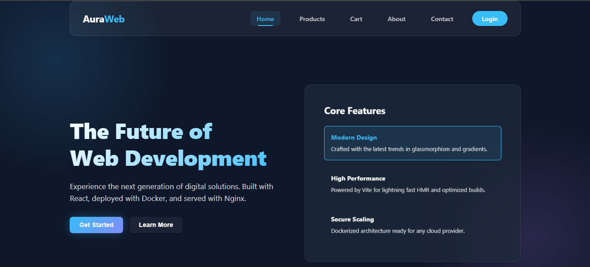
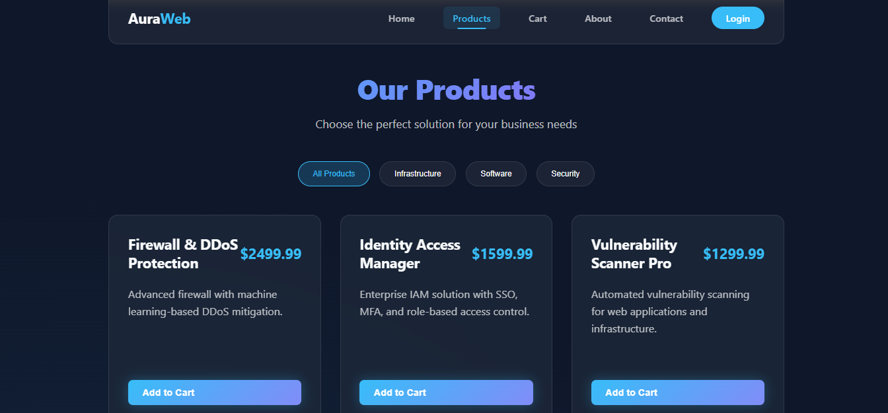
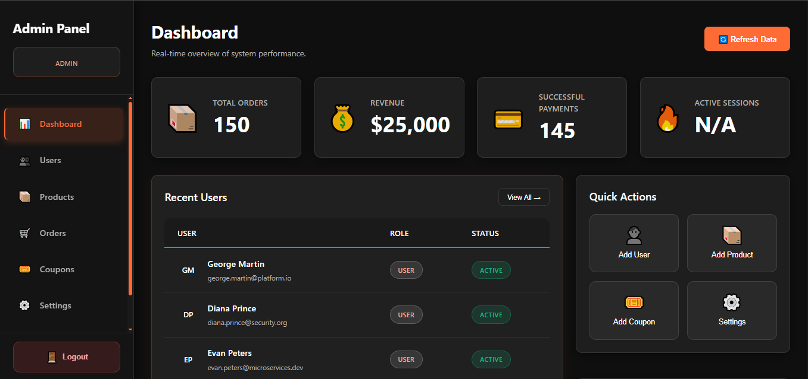
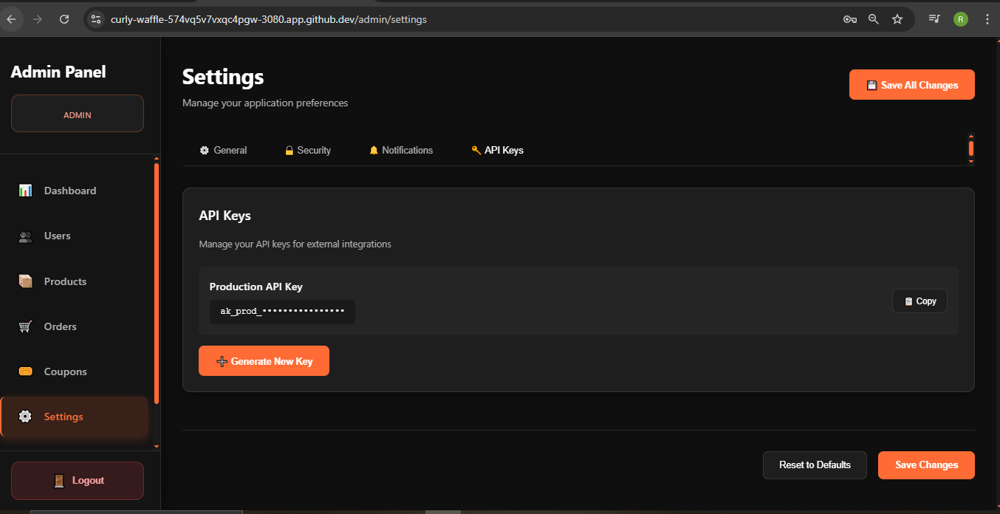
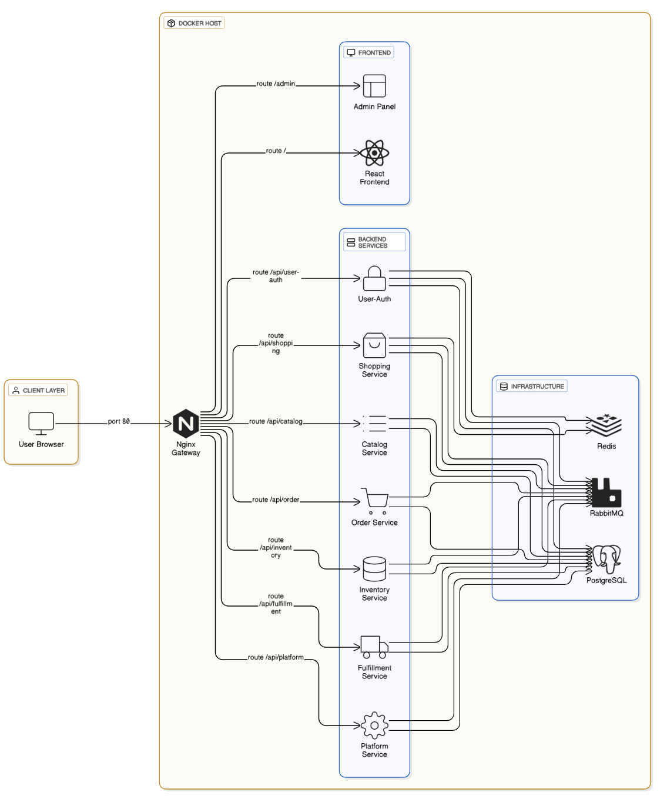
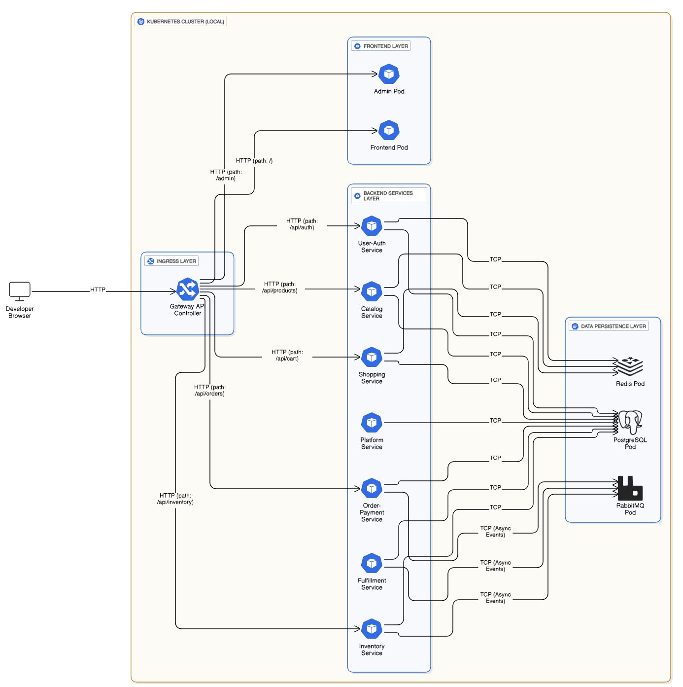
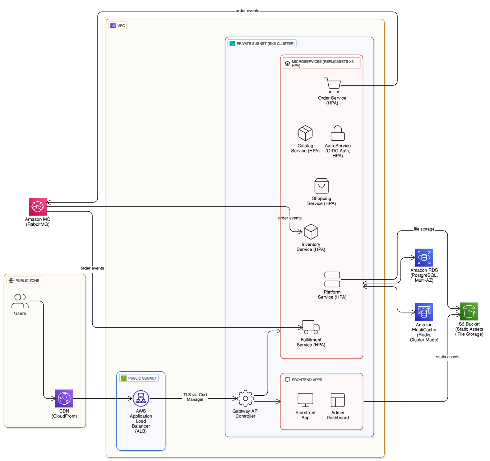

# Docker, Nginx, React & Kubernetes Full-Stack Starter (Microservices)

> **Enterprise-Grade Full-Stack Microservices Platform with Kubernetes-Native Architecture**

A production-ready, cloud-native full-stack application demonstrating modern DevOps practices, microservices architecture, and comprehensive observability. Built for scalability, security, and ease of deployment across local and cloud environments.

## ✨ Key Features

*   **Kubernetes-Native Architecture**: Production-ready Kubernetes manifests with Kustomize overlays for multi-environment deployments.
*   **Microservices Design**: Containerized services with Docker, orchestrated via Docker Compose (local) and Kubernetes (production).
*   **Full-Stack React Applications**: Separate, optimized React 19 + Vite 7 applications for public Frontend and Admin Panel.
*   **Robust Backend API**: Node.js & Express.js with JWT authentication, RBAC, and comprehensive error handling.
*   **Enterprise Database**: PostgreSQL 16 with connection pooling, health checks, and persistent storage.
*   **Comprehensive Observability**:
    *   **Logging**: Structured logging with Winston and daily log rotation
    *   **Metrics**: Prometheus integration for performance monitoring
    *   **Error Tracking**: Sentry integration for real-time error monitoring
*   **Multi-Platform CI/CD**: Ready-to-use pipelines for GitHub Actions, GitLab CI, Jenkins, CircleCI, and ArgoCD (GitOps).
*   **Production-Hardened Security**: 
    *   Rate limiting and DDoS protection
    *   Security headers (CSP, HSTS, X-Frame-Options)
    *   JWT token management with refresh tokens
    *   Network isolation and service mesh ready
*   **Unified Deployment CLI**: Interactive deployment script supporting local Docker Compose, local Kubernetes, and cloud deployments.
*   **Infrastructure as Code**: Complete Kubernetes manifests, Dockerfiles, and deployment automation.

## 🛠️ Technologies Used

**Frontend**: React 19, Vite 7, React Router 6, Axios  
**Backend**: Node.js 18+, Express.js 4, JWT Authentication, bcrypt  
**Database**: PostgreSQL 16 (Alpine)  
**Infrastructure**: Docker, Docker Compose, Kubernetes (Kustomize)  
**Gateway**: Nginx (reverse proxy with security hardening)  
**Observability**: Winston (logging), Prometheus (metrics), Sentry (error tracking)  
**DevOps**: CI/CD (GitHub Actions/GitLab/Jenkins/CircleCI), ArgoCD (GitOps), Nginx Ingress, HPA

---

## 📸 Screenshots

### User Interface

| **Home Page** | **Products Page** |
|:---:|:---:|
|  |  |

| **Admin Dashboard** | **Admin Settings** |
|:---:|:---:|
|  |  |

---

## 🏗️ Architecture

The application implements a modern **Event-Driven Microservices Architecture**, consolidated into 7 domain-specific services for optimal resource usage and maintainability.

### Service Landscape

| Service | Port | Description | Tech Stack |
| :--- | :--- | :--- | :--- |
| **Gateway** | `80` | Nginx reverse proxy, SSL termination, rate limiting | Nginx |
| **Frontend** | `80` | Public-facing e-commerce store | React 19, Vite |
| **Admin** | `80` | Back-office management dashboard | React 19, Vite |
| **User & Auth** | `3000` | Authentication (JWT), User Profiles, Profile Mgmt | Node.js, Express |
| **Catalog** | `3001` | Product management, **Redis Search** integration | Node.js, PostgreSQL |
| **Order & Payment** | `3002` | Order processing, Stripe payments, Saga implementation | Node.js, RabbitMQ |
| **Fulfillment** | `3003` | Shipping logistics, Coupon validation | Node.js, Express |
| **Shopping** | `3004` | High-performance Cart & Wishlist management | Node.js, Redis |
| **Platform** | `3005` | Analytics, File Storage (S3/MinIO), Admin Ops | Node.js, AWS SDK |
| **Inventory** | `3006` | Real-time stock tracking and reservations | Node.js, PostgreSQL |

### Architecture Diagrams

#### 1. Local Development (Docker Compose)

#### 2. Local Kubernetes (Envoy Gateway)

#### 3. Production Cloud Architecture (AWS EKS)

---

## 💼 Skills & Capabilities Demonstrated

This project serves as a comprehensive example of **DevOps**, **DevSecOps**, and **Full-Stack Engineering** capabilities.

### 🛡️ DevSecOps & Security
*   **Secret Management**: Implemented secure environment variable handling with `.gitignore` policies and **GitHub Push Protection** compliance.
*   **Container Security**: Non-root user execution in Dockerfiles, minimized base images (Alpine Linux).
*   **API Security**: Nginx-based rate limiting, Helmet.js headers, XSS/SQL Injection protection.
*   **Auth**: Robust JWT implementation with Refresh Tokens and Role-Based Access Control (RBAC).

### ☁️ Cloud-Native & Kubernetes
*   **Orchestration**: Production-ready **Kubernetes** manifests with `Kustomize` for DRY configuration across environments (Dev/Prod).
*   **Self-Healing**: Liveness and Readiness probes configured for zero-downtime deployments.
*   **Scalability**: Stateless microservices design ready for Horizontal Pod Autoscaling (HPA).
*   **Service Mesh Ready**: Architecture supports Sidecar patterns and mTLS.

### 🔄 CI/CD & Automation
*   **GitOps**: ArgoCD configuration for declarative continuous delivery.
*   **Pipeline Code**: Reusable workflows for GitHub Actions, Jenkins, and GitLab CI.
*   **Infrastructure as Code**: Fully scripted environment setup (`scripts/deploy`) and verify (`scripts/validate-env.sh`).

### ⚡ Performance & Observability
*   **Caching Strategy**: Multi-layer caching using **Redis** for sessions and **Redis Search** for high-speed product queries (replacing Elasticsearch).
*   **Async Architecture**: Event-driven communication via **RabbitMQ** to decouple critical paths (e.g., Order -> Fulfillment).
*   **Monitoring**: Integrated **Prometheus** metrics endpoint and structured **Winston** logging.

---

## 📚 Documentation & Guides

Complete documentation available in the `docs/` directory:

*   **[🚀 Deployment Guide](docs/00-Deployment-Overview.md)** - How to run locally or in cloud.
*   **[☸️ Kubernetes Setup](docs/07-Deployment-Local-Kubernetes.md)** - K8s manifests and Kustomize.
*   **[🔄 CI/CD Pipelines](docs/00-CICD-Platform-Comparison.md)** - Setup guides for Jenkins/GitHub Actions.
*   **[📂 Project Structure](docs/10-Project-Structure.md)** - Deep dive into code organization.

## 🔐 Default Credentials (Dev)
*   **Admin User**: `admin@auraweb.com` / `Admin@123`
*   **Database**: `auraweb_user` / `password`

> [!CAUTION]
> **Production Notice**: Always rotate these credentials and use Secret Managers (Values or Vault) for production deployments.

---

## 🤝 Contributing
Open Pull Requests are welcome. Please ensure they pass the pre-commit hooks and linting standards.

**License**: MIT

**Author / Maintained by**: Ravi Kumar Kushwaha

--- 

> **Keywords**: Kubernetes, DevSecOps, Docker, Microservices, React 19, Node.js, Redis, RabbitMQ, PostgreSQL, GitOps, ArgoCD, Jenkins, GitHub Actions, Security, Scalability, Full-Stack.
